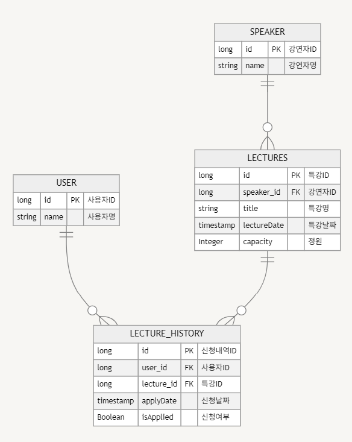

# TDD & 클린아키텍처

## 📝목차

1. [요구사항](#1.-요구사항)
2. [erd](#2.-erd)

 

## 1. 요구사항
1️⃣ **(핵심)** 특강 신청 **API**

- 특정 userId 로 선착순으로 제공되는 특강을 신청하는 API 를 작성합니다.
- 동일한 신청자는 동일한 강의에 대해서 한 번의 수강 신청만 성공할 수 있습니다.
- 특강은 선착순 30명만 신청 가능합니다.
- 이미 신청자가 30명이 초과 되면 이후 신청자는 요청을 실패합니다.

2️⃣  특강 목록 조회 **API**

- 날짜별로 현재 신청 가능한 특강 목록을 조회하는 API 를 작성합니다.
- 특강의 정원은 30명으로 고정이며, 사용자는 각 특강에 신청하기 전 목록을 조회해 볼 수 있어야 합니다.

3️⃣  특강 신청 완료 목록 조회 **API**

- 특정 userId 로 신청 완료된 특강 목록을 조회하는 API 를 작성합니다.
- 각 항목은 특강 ID 및 이름, 강연자 정보를 담고 있어야 합니다.

 

## 2. erd

    USER {
        long id PK "사용자ID"
        string name "사용자명"
    }

    SPEAKER {
        long id PK "강연자ID"
        string name "강연자명"
    }

    LECTURES {
        long id PK "특강ID"
        long speaker_id FK "강연자ID"
        string title "특강명"
        timestamp lectureDate "특강날짜"
        Integer capacity "정원"
    }

    LECTURE_HISTORY {
        long id PK "신청내역ID"
        long user_id FK "사용자ID"
        long lecture_id FK "특강ID"
        timestamp applyDate "신청날짜"
        Boolean isApplied "신청여부"
    }

    USER ||--o{ LECTURE_HISTORY : ""
    LECTURES ||--o{ LECTURE_HISTORY : ""
    SPEAKER ||--o{ LECTURES : ""

 
### **ERD 설명**

1. **USER 테이블**:
    - **필드**:
      - `id` (사용자 ID)
      - `name` (사용자명)
    - **설명**: 기본적인 유저 정보를 관리한다.

2. **SPEAKER 테이블**:
    - **필드**:
      - `id` (강연자 ID)
      - `name` (강연자명)
    - **설명**: 강연자 정보를 관리한다.

3. **LECTURES 테이블**:
    - **필드**:
        - `id` (특강 ID)
        - `speaker_id` (강연자 ID)
        - `title` (특강명)
        - `lectureDate` (특강 날짜)
        - `capacity` (정원)
    - **설명**: 특강 정보를 관리한다.
   

4. **LECTURE_HISTORY 테이블**:
    - **필드**: 
      - `id` (신청내역 ID)
      - `user_id` (사용자 ID)
      - `lecture_id` (특강 ID)
      - `applyDate` (신청 날짜)
      - `isApplied` (신청 여부)
    - **설명**: 사용자가 신청한 특강 내역을 저장한다.
   
### **관계**

- `USERS ||--o{ LECTURE_HISTORY`:
    - 사용자는 여러 개의 신청 기록을 가질 수 있다.
- `LECTURES ||--o{ LECTURE_HISTORY`:
    - 각 특강은 여러 개의 신청 기록을 가질 수 있다.
- `SPEAKER ||--o{ LECTURES`:
    - 각 강연자는 여러 개의 특강을 진행할 수 있다.